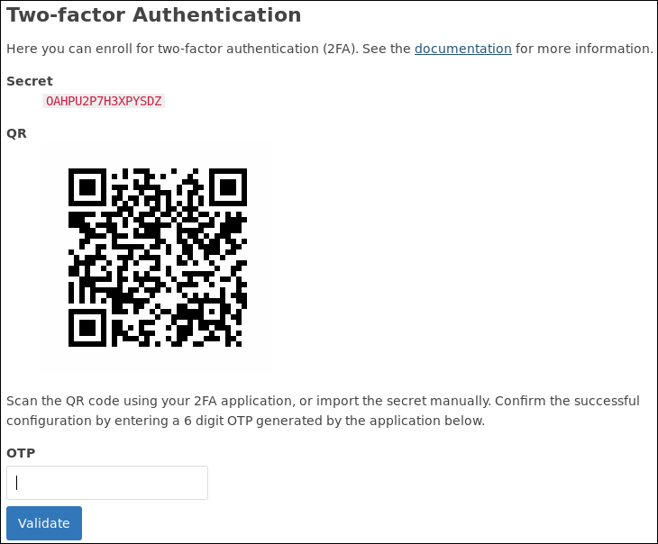

# Two-factor Authentication

The software supports two-factor authentication (2FA) for connecting to the 
VPN.

The users can enroll themselves in the portal on the "Account" page. This is
only effective if 2FA is actually enabled on the VPN server.

At the moment only 
[TOTP](https://en.wikipedia.org/wiki/Time-based_One-time_Password_Algorithm) is 
supported.

## Enrollment

The user portal can be used for enrollment on the "Account" page. A QR code is 
shown that can be scanned by an application (see below) or the secret can be 
manually copy/pasted in a TOTP application.

A user can **not** cancel the enrollment. This is on purpose as allowing the 
user to remove the 2FA would be a security risk.

An administrator can delete the OTP secret for a particular user in the 
admin portal.

## Applications

### Command Line

You can test the deploying using a command line tool, 
[oathtool](http://www.nongnu.org/oath-toolkit/):

    $ oathtool --totp -b K5LY7VPKBFQJZQBU

This should give you a valid 6 digit OTP that passes the validation. It is not
recommended to use this tool on the same machine as the one you are connecting
to the VPN from as that defeats the purpose of 2FA. Use a mobile application, 
or use it on a different device.

### Mobile

You can use  [FreeOTP](https://fedorahosted.org/freeotp/) or 
[Google Authenticator](https://en.wikipedia.org/wiki/Google_Authenticator) on 
your mobile device. We recommend FreeOTP.
    
- Android ([Google Play Store](https://play.google.com/store/apps/details?id=org.fedorahosted.freeotp), 
  [F-Droid](https://f-droid.org/repository/browse/?fdid=org.fedorahosted.freeotp))
- iOS ([iTunes](https://itunes.apple.com/us/app/freeotp/id872559395))
    
Both applications can be used to scan the QR code on the enrollment page. To 
confirm the enrollment, a OTP needs to be provided to confirm the correct 
configuration of the OTP application.

## Connecting

After the enrollment process is complete and you want to connect to the VPN 
server, the client will ask for a user name and password. A user name you 
use `totp` and as password the 6 digit code generated by the OTP application.

For example with the community client of OpenVPN on Windows you will see this:

