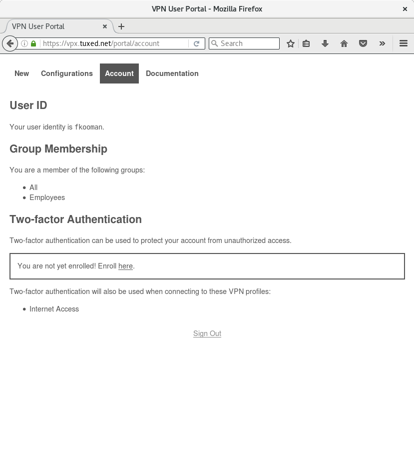
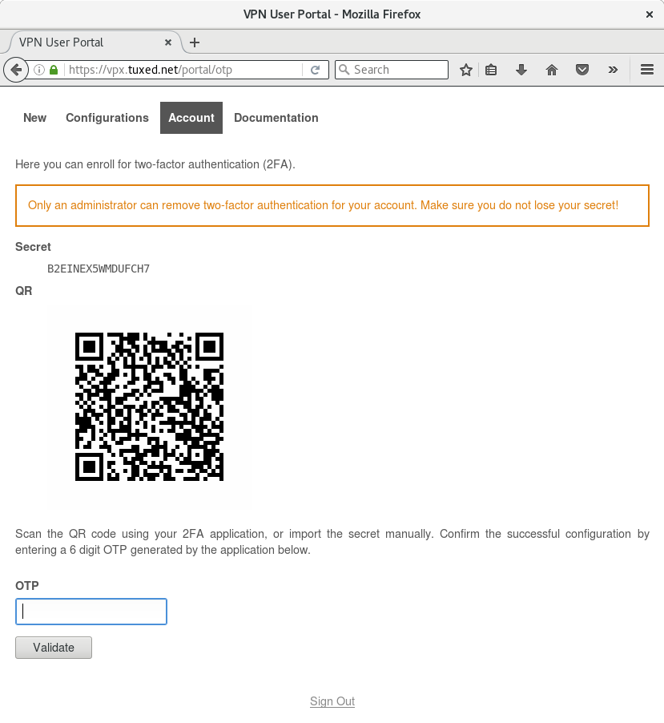
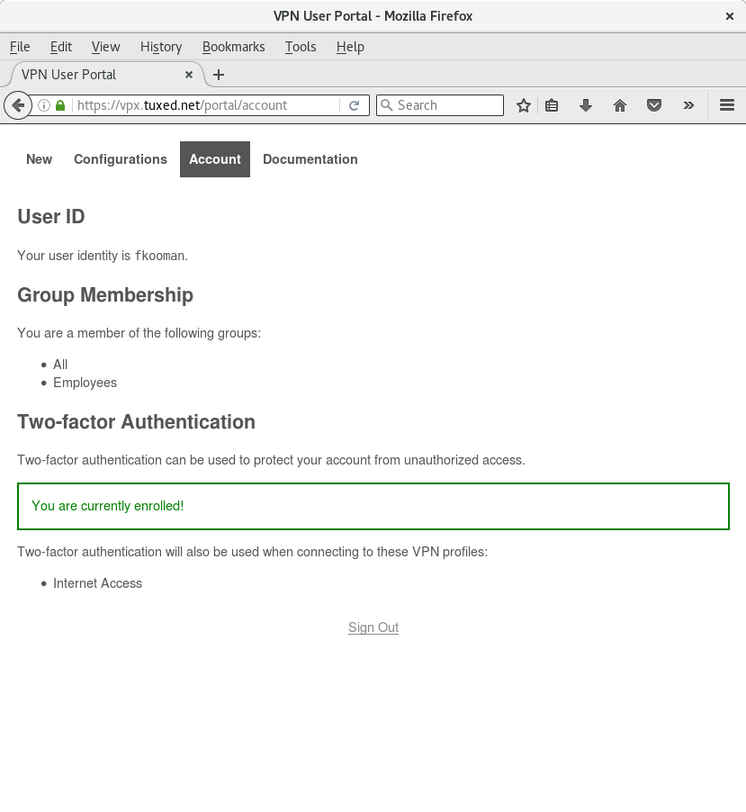
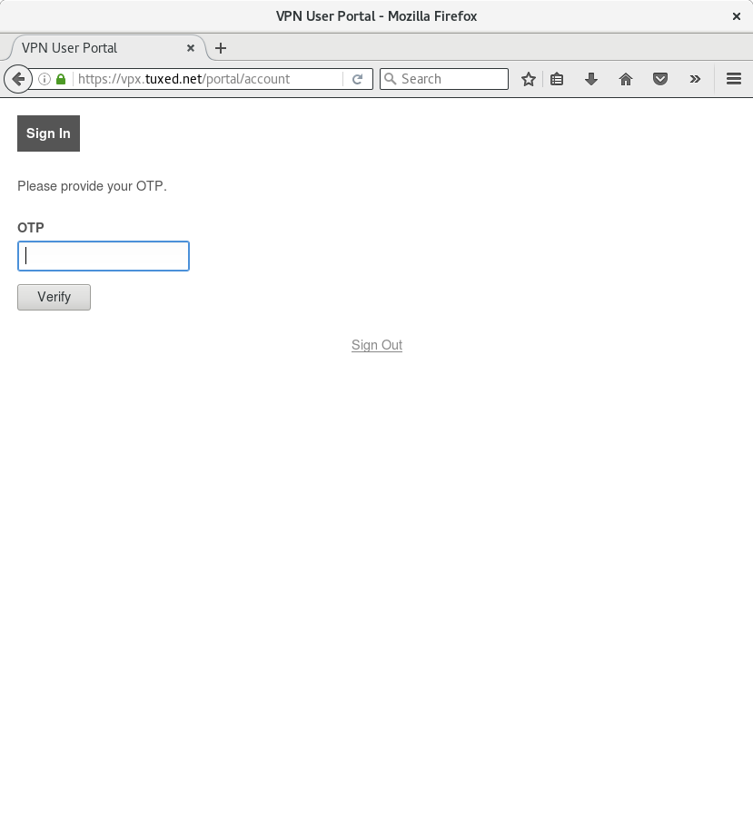
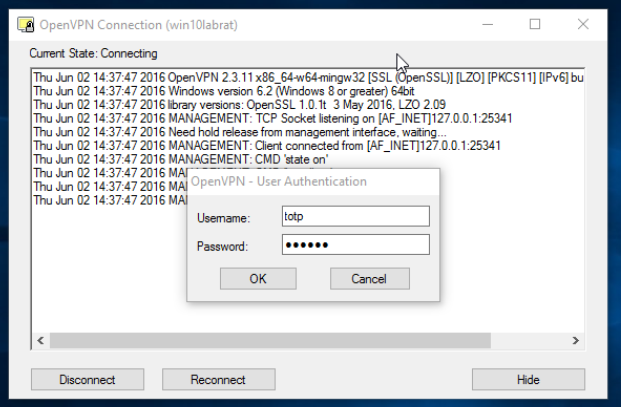

# Two-factor Authentication

The software supports two-factor authentication (2FA) for both authenticating
at the user/admin portal and for connecting to the VPN.

Users can enroll themselves in the portal on the "Account" page. If the user
is enrolled for 2FA, this will also automatically be used for authenticating
to the admin portal.

Currently only 
[TOTP](https://en.wikipedia.org/wiki/Time-based_One-time_Password_Algorithm) is 
supported.

## Enrollment

The user portal can be used for enrollment on the "Account" page. A QR code is 
shown that can be scanned by an application (see below) or the secret can be 
manually copy/pasted in a TOTP application. Users currently cannot remove their 
2FA enrollment, an administrator can remove the OTP secret for a particular 
user in the admin portal.

Before the user is enrolled:

The enrollment process:

After the user is enrolled:

## Authenticating

Authenticating to the (user) portal when the user is enrolled for 2FA:

## OTP Applications

### Command Line

You can test the deploying using a command line tool, 
[oathtool](http://www.nongnu.org/oath-toolkit/):

    $ oathtool --totp -b K5LY7VPKBFQJZQBU

This should give you a valid 6 digit OTP that passes the validation. It is not
recommended to use this tool on the same machine as the one you are connecting
to the VPN from as that defeats the purpose of 2FA. Use a mobile application, 
or use it on a different device.

### Mobile

You can use  [FreeOTP](https://fedorahosted.org/freeotp/) or 
[Google Authenticator](https://en.wikipedia.org/wiki/Google_Authenticator) on 
your mobile device. We recommend FreeOTP.
    
- Android ([Google Play Store](https://play.google.com/store/apps/details?id=org.fedorahosted.freeotp), 
  [F-Droid](https://f-droid.org/repository/browse/?fdid=org.fedorahosted.freeotp))
- iOS ([iTunes](https://itunes.apple.com/us/app/freeotp/id872559395))
    
Both applications can be used to scan the QR code on the enrollment page. To 
confirm the enrollment, a OTP needs to be provided to confirm the correct 
configuration of the OTP application.

## VPN

Two-factor authentication needs to be enabled per VPN profile. Once activated,
the users will need to provide their OTP key also when authenticating to the
VPN. The client will ask for a user name and password. The user name MUST be
`totp` and as password the 6 digit code generated by the OTP application.

For example with the community client of OpenVPN on Windows you will see this:

# Enabling 2FA for VPNs

Assuming your instance is called `vpn.example`, you need to modify 
`/etc/vpn-server-api/vpn.example/config.yaml`:

    vpnProfiles:
        internet:
            :
            twoFactor: true
            :

Now the server configuration needs to be regenerated:

    $ sudo vpn-server-node-server-config --instance vpn.example --profile internet

Also, the VPN processes need to be restarted:

    $ sudo systemctl restart openvpn@server-vpn.example-internet-{0,3}

That's all!

## Recovery

Assuming an administrator is enrolled for OTP, but loses their secret, the 
enrollment can be cancelled by removing a file. Assuming the user ID is `foo` 
and the instance is `vpn.example` it works like this:

    $ sudo rm /var/lib/vpn-server-api/vpn.example/users/otp_secrets/foo

Then the enrollment process can be restarted.
