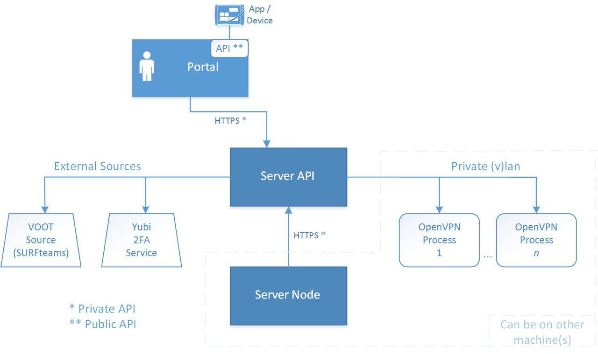

# Architecture

This is a very short overview of the server architecture for version 1.0 of 
eduVPN.

## Components

The VPN service consists of the following components:

- Server API (vpn-server-api);
- User Portal (vpn-user-portal);
- Admin Portal (vpn-admin-portal);
- Server Node (vpn-server-node);

### Server API

This is the central component. It manages the CA, users, and interfaces with 
various other components, for example to verify [2FA](2FA.md) tokens or group 
[ACLs](ACL.md).

### User Portal

This components is for interacting with the user through the browser. It allows
the user to download OpenVPN configuration files and enroll for 2FA.

#### API

The user portal has an [API](API.md) that is used by (mobile) applications to 
use the VPN service as user friendly as possible. This API implements OAuth 
2.0 and is called the "Public API".

### Admin Portal

This component exists to allow designated administrators to manage the VPN 
service, see active connections and see connection statistics.

### Server Node

This component is used to generate OpenVPN server configurations and generate
the firewall rules.

## IPC

The User Portal, Admin Portal and Server Node components communicate with the 
Server API over HTTP. They use HTTP Basic credentials for authentication. 
This is the "Private API". When the Server Node component is installed on 
another machine, HTTPS is used to communicate with the Server API.

In addition, the Server API needs to talk to the OpenVPN processes using a 
private (V)LAN, this is to kill active connections and obtain a list of 
currently connected clients.

## Authentication

The users and administrators authenticate with the User Portal and Admin
Portal, either with:

- username and password;
- SAML (identity federations).

The same mechanism is also used for the authentication phase of the OAuth 
authorization for the API.

## Deployment

The are two ways to deploy the software:

- run it on 1 machine (VM);
- run it on multiple machines (VMs).

When run on 1 machine, all four mentioned components are installed on the same
machine. When run on multiple machines, the User Portal, Admin Portal and 
Server API are installed on 1 machine, and the Server Node on the other 
machine(s).

