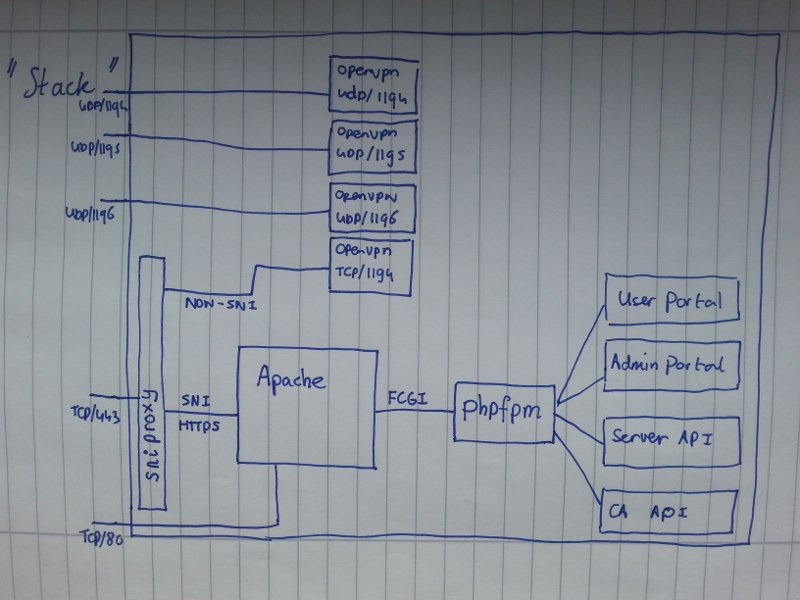

# Architecture

This document describes the architecture of the software, its components and
how it interacts.

# "Stack"

This image describes the "default" configuration of the software using the 
`deploy.sh` script found in this repository.

## sniproxy

[sniproxy](https://github.com/dlundquist/sniproxy) is used to share `TCP/443` 
between Apache and the OpenVPN TCP instance. This is to avoid broken networks
or network filters where UDP connections are blocked or broken.

## Apache

Apache the software together. Both the user visible components (User Portal and 
Admin Portal), as well as the internal services (Server API and CA API) are all 
routed through Apache. The communication between the components is also done
through Apache. This makes it possible to separate the components in different
containers, VMs or even physical machines.

## PHP FPM

The software is written in PHP and behind the PHP 
[FastCGI Process Manager](https://secure.php.net/manual/en/install.fpm.php). 
This increases the performance and does not require `mod_php` running in 
Apache.

## OpenVPN

The OpenVPN processes run using configurations generated by Server API. By 
default they listen on `UDP/1194`, `UDP/1195`, `UDP/1196` and `TCP/1194`. The 
`TCP/1194` instance is connected to by sniproxy to allow OpenVPN clients to 
connect over `TCP/443`.

## User Portal

The [User Portal](https://github.com/eduvpn/vpn-user-portal) allows end users 
using a web browser to create configurations, i.e. certificates, enroll for 
two-factor authentication and disable their certificates when losing a device. 

In addition to using a web browser to access the portal, an OAuth 2.0 protected
API is also available. This can e.g. be used by applications running on a 
device to obtain a configuration without requiring the user to manually 
download and install OpenVPN configurations.

The User Portal interacts with the Server API and CA API.

## Admin Portal

The [Admin Portal](https://github.com/eduvpn/vpn-admin-portal) allows 
administrators using a web browser to manage user's configurations 
(certificates). It also has to option to disable (and re-enable) certificates, 
throw away user's two-factor secret, and completely block and unblock users. It 
can also be used to view currently connected clients, get an overview of the 
usage (stats) and search the connection logs.

The Admin Portal interacts with the Server API and CA API.

## CA API

The [CA API](https://github.com/eduvpn/vpn-ca-api) is responsible for 
everything related to certificates. It can be used to generate user 
certificates and server certificates.

## Server API

The [Server API](https://github.com/eduvpn/vpn-server-api) is responsible for 
storing the list of disabled users and certificates, the two-factor secrets of
the users and the group membership information.

It also contains the scripts that the OpenVPN instances will use when a client
connects, to handle the connect events, to verify if they are allow to connect,
handle disconnect events and verifying the OTP keys if two-factor 
authentication is enabled.
