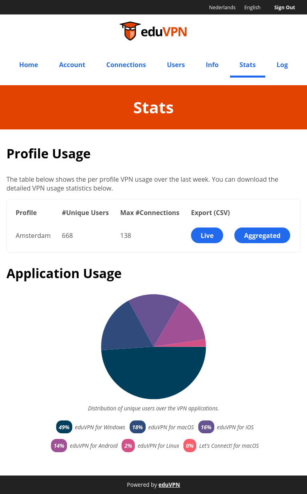
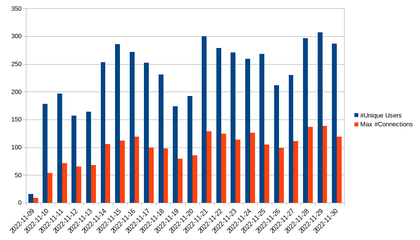

# Statistics

The sevice provides a number of ways to keep an eye on how it is being used.

1. The "Stats" page in the portal (see [Portal Admin](PORTAL_ADMIN.md) to 
   enable "Admin" access for your account);
2. Through the CLI using `vpn-user-portal-status`;

## Stats Page



The "Profile Usage" shows the number of unique users that used this profile in 
the last week _and_ the number of "concurrent connections" to that profile. 

The information on this page is updated in 5 minute intervals.

The "Export" buttons allow you to export the "Live" and "Aggregate" information
to CSV for import in the tool of your choice, for example to generate graphs. 

As an example, we import the "Aggregated" data in LibreOffice to generate a
graph.



## CLI Tooling

If you prefer using the CLI, for example to run it automated, we have some 
options for this as well.

```bash
$ sudo vpn-user-portal-status --json
[
    {
        "profile_id": "ams",
        "active_connection_count": 106,
        "max_connection_count": 997,
        "percentage_in_use": 10
    }
]
```

If you want to implement _alerting_, you can have a look [here](MONITORING.md)
