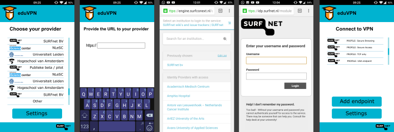

NOTE: Still under construction! Not definitive.

# Windows Functional Requirements

This document describes the functional requirements of eduVPN for Windows. This means it will describe *what* the application must be capable of and not necessarily how, although there will be some implementation suggestions mentioned throughout and some acceptance criteria as well.

## Supported versions of Windows

#### Required operating system versions
These operating systems should be supported by the eduVPN application.
- All versions of Microsoft Windows 7 with Service Pack 1
- All versions of Microsoft Windows 8.1
- All versions of Microsoft Windows 10
- All versions of Microsoft Windows Server 2008*
- All versions of Microsoft Windows Server 2008 R2*
- All versions of Microsoft Windows Server 2012*
- All versions of Microsoft Windows Server 2012 R2*
- All versions of Microsoft Windows Server 2016*

* Only versions with a GUI. So no Core-editions or Nano-versions.

#### Nice to have operating system versions
These operating systems are not necessary, but if they will work without considerable extra effort it will be a bonus.
- All versions of Microsoft Windows Vista are supported.
- All versions of Microsoft Windows 7 (without Service Pack 1) are supported
- All versions of Microsoft Windows 8 are supported.

#### Versions that should not be supported
These operating systems should not be supported. They are insecure, old, crappy and evil ;).
- All versions of Microsoft Windows XP and lower.

# Why an eduVPN App?

Configuring eduvpn on your Windows device is quite involved, i.e. it 
requires a relatively big number of steps and is limited in after-configuration 
updates and changes. 

Assuming you want to use eduVPN on Windows you need to go through these steps:

1. Install 'OpenVPN GUI' from the OpenVPN website;
2. Open a browser and go to `https://eduvpn.surfcloud.nl/`;
3. Choose your institute;
4. Authenticate using your institution account;
5. Create a new configuration in the portal and store the download on the device;
6. Move the file from the download folder to the [openvpn-install-folder]\config. 
    This will probably be 'C:\Program Files\OpenVPN\config'
7. Open 'OpenVPN GUI' and right click the OpenVPN GUI icon in the icon tray. Move to the downloaded configuration file and select 'Connect' in the drop-out menu.
8. Start using the VPN.

We'd like to make this simpler and more secure for the user, i.e. reduce the
number of steps and no require to download a configuration file containing 
private keys.

So, we'd like to optimize the flow as follows:

1. Install the eduVPN application from https://eduvpn.nl;
2. Open the the eduVPN application;
3. Choose your institute;
4. Authenticate using your institution account;
5. Start using the VPN!

Between step 4 and 5 the configuration is automatically downloaded and installed.

# Benefits

With this optimized flow we can accomplish further benefits without 
requiring user involvement:

1. If there is configuration file (format) update this can be handled "out of band" without requiring user interaction;
2. If the VPN technology itself is to be updated this can be done transparently using just an application update;
3. If the configuration/certificate is about to expire it can be automatically renewed;
4. It can provide a channel to inform the user about maintenance or problems, e.g. the user is banned because of a malware infection, or is no longer entitled to use the VPN;
5. The configuration does not have to be downloaded and moved manually. Some users will use copy-paste instead of move so the configuration with certificate will still exist in the download folder.

# User Experience

The depicted application flow is made for Android. It will look differently on Windows, but in general the flow is the same.

[See Big Version](app_flow_big.png)

# Architecture 

Everyone can deploy their own instance of eduVPN. The application MUST be able
to connect to a predefined list of instances, but also to instances not yet 
added to this list.

# API 

The eduVPN services exposes an API that can be used by the application to 
obtain a configuration. This API is protected using OAuth 2.0 (RFC 6749). This 
makes it possible to integrate the application with an instance without 
requiring a specific authentication mechanism. This way it becomes possible to 
support e.g. SAML or OpenID Connect without modifying the application. 

OAuth 2.0 will here be in essence used as a way to provision an 
application/device specific password called a Bearer token (RFC 6750).

## Discovery

Each instance will provide a JSON document with information about that 
instance. The following information will be made available through this 
document:

* The `authorization_endpoint` for OAuth 2.0 authorization;
* The `token_endpoint` for OAuth 2.0 token exchange;
* The `api_endpoint` for interacting with the API using Bearer tokens;
* ...
* ...

The exact format is still to be determined.

## Authorization

Each instance can configure their own authentication, it could be a simple 
username/password authentication or be integrated in a SAML federation. This 
is of no consequence to the app. The app will only use OAuth 2.0 and Bearer 
tokens to interact with the instance.

The app will open an browser and point it to the `authorization_endpoint`, at that point the instance will take care of the 
user authentication and provide an `authorization_code` that will be provided
back to the app using the `redirect_uri` that will need to be caught by the 
app using an intent registration.

The obtained `authorization_code` can be exchanged for an `access_token` at the
`token_endpoint`. The obtained `access_token` will be a Bearer token that can 
be used at the `api_endpoint` to interact with the API.

**NOTE**: this describes the OAuth 2.0 "authorization code" flow, it may very
well be that the "implicit grant" flow will also be supported which is somewhat
simpler.
 
# Development

The target platform should be Android >= 4.

**Principle**: anyone with a computer with just Android Studio on it MUST be 
able to build the application and its dependencies from source in the easiest 
way possible and generate an installable application (APK).

The "OpenVPN for Android" application from Arne Schwabe SHOULD be used. This is 
free software and can be integrated directly in the eduvpn app. This is 
documented in the source repository of OpenVPN for Android. It may be possible
to use the OpenVPN for Android API when OpenVPN for Android is already 
installed, or its installation could be requested/triggered.

The application MUST be built from source using only free software components
and tools. 

It must be made available to at least these two App stores:

* [Google Play](https://play.google.com/)
* [F-Droid](https://f-droid.org/)

The requirement for being available through F-Droid means that no Google 
proprietary libraries may be used, e.g. "Google Cloud Messaging" and that the 
application can be built from source straight from a public repository. See 
also the F-Droid Inclusion Policy.

In case additional dependencies are required, they should be clearly mentioned 
in the main README, MUST be free software as well, MUST have compatible 
licensing.

No proprietary tools may be used for building, deploying, signing or publishing
the application. Best practices as documented by Google MUST be followed
unless there are very good reasons for not doing that. 

## Additional Requirements

1. The downloaded VPN configuration and/or other secrets MUST be only stored in 
   protected storage that is only available to the eduvpn application;
2. The list of eduvpn instances MUST be very easy to update;
3. It MUST be possible to manually specify an instance by its URL in case it 
   is not yet listed in the eduvpn app;
4. Root permissions MUST NOT be required;
5. The license MUST be compatible with OpenVPN and OpenVPN for Android, this 
   means it MUST be released under the GPL license. An exact license still 
   needs to be determined, but initially the GPLv3 (or later) MUST be used.
 
# PoC

A proof of concept application is available 
[here](https://github.com/eduvpn/android). It more or less works, but still
has lots of issues, and is far from complete, see also the TODO section there.

# References

* [OpenVPN for Android](https://github.com/schwabe/ics-openvpn)
* RFC 6749 [The OAuth 2.0 Authorization Framework](https://tools.ietf.org/html/rfc6749)
* RFC 6750 [The OAuth 2.0 Authorization Framework: Bearer Token Usage](https://tools.ietf.org/html/rfc6750)
* [F-Droid Inclusion Policy](https://f-droid.org/wiki/page/Inclusion_Policy)
